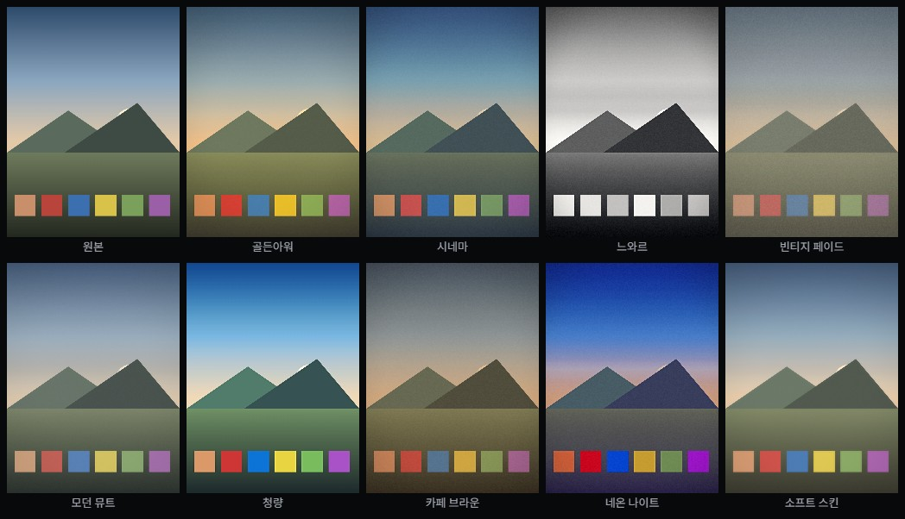

# LUME — 라이트룸 프리셋 카메라

라이트룸 `.xmp` 프리셋을 올리면 **그 색감 그대로 카메라 미리보기에 실시간 적용**되고,
그 상태로 사진·영상을 찍는 안드로이드 앱입니다. (iOS 는 같은 코드로 이어서 추가 가능)



*↑ 같은 장면에 내장 프리셋 9종을 적용한 실제 렌더링 결과 (엔진 출력물)*

```
photo app/
├─ www/                  ← 앱 본체 (이것만 고치면 됩니다)
│  ├─ index.html         카메라
│  ├─ studio.html        프리셋 편집 · 일괄 처리 (studio.css)
│  ├─ try.html           카메라 없이 프리셋만 적용해보는 페이지
│  ├─ styles.css
│  └─ js/
│     ├─ store.js        저장소 · 파일 저장 · 공유
│     ├─ xmp.js          XMP 파싱/생성 · 프리셋 데이터 모델
│     ├─ presets.js      내장 프리셋 9종
│     ├─ gl.js           실시간 색보정 엔진 (WebGL 셰이더)
│     ├─ camera.js       카메라 · 사진 촬영 · 영상 녹화
│     ├─ analyze.js      자동 화이트밸런스 · 히스토그램
│     ├─ sample.js       사진이 없을 때 쓰는 샘플 장면
│     ├─ zip.js          ZIP 작성기 (일괄 내보내기용)
│     ├─ studio.js       Studio 화면
│     ├─ ui.js           화면 · 편집기 · 보관함
│     └─ app.js          부팅 · 뒤로가기
├─ scripts/
│  ├─ patch-android.js   카메라 권한 · 세로 고정 · 앱 이름
│  ├─ make-icons.js      앱 아이콘 생성 (외부 라이브러리 없음)
│  ├─ preview-server.js  PC 브라우저 미리보기용 정적 서버
│  └─ render-presets.js  프리셋 적용 결과를 PNG 로 뽑기
├─ capacitor.config.json
└─ .github/workflows/android.yml
```

---

## 무엇이 되나요

| 기능 | 상태 |
|---|---|
| XMP 프리셋 불러오기 → 실시간 미리보기 | ✅ |
| 프리셋 적용 상태 그대로 사진 촬영 | ✅ |
| 프리셋 적용 상태 그대로 영상 녹화(소리 포함) | ✅ |
| 프리셋 강도 조절 (0~100%) | ✅ |
| 프리셋 직접 만들기·수정 (톤커브·HSL·컬러그레이딩) | ✅ |
| 내가 만든 프리셋을 `.xmp` 로 내보내기 (라이트룸에서 그대로 열림) | ✅ |
| 3:4 · 9:16 · 1:1 비율, 격자, 플래시, 핀치 줌, 탭 초점 | ✅ |
| 커뮤니티 마켓 | 화면만 준비 (서버 미연결) |

### 실시간 반영되는 라이트룸 항목

색온도 · 색조 · 노출 · 대비 · 밝은 영역 · 어두운 영역 · 흰색 · 검정 ·
텍스처 · 부분 대비 · 안개 현상 제거 · 생동감 · 채도 ·
톤 커브(RGB/R/G/B + 매개변수 커브) · HSL 8채널(색조/채도/휘도) ·
컬러 그레이딩(어두운 영역/중간톤/밝은 영역/전체 + 혼합·균형) ·
비네팅 · 그레인 · 페이드 · 선명도 · 흑백 변환

> GPU 셰이더로 라이트룸 파이프라인을 **근사**합니다. 라이트룸이 RAW 에 적용하는 결과와
> 픽셀 단위로 같지는 않지만, 프리셋의 성격(색의 방향·톤의 모양)은 그대로 재현됩니다.
> 렌즈 보정·노이즈 제거·마스킹·프로파일(.dcp) 은 적용되지 않습니다.

---

## 빌드 방법

### A. GitHub Actions — 아무것도 설치하지 않음 (권장)

이 폴더를 **저장소 루트로** 올립니다.

```bash
git init && git add -A && git commit -m "LUME 카메라"
git branch -M main
git remote add origin https://github.com/<계정>/<저장소>.git
git push -u origin main
```

푸시하면 자동으로 빌드가 돌고, 저장소 **Actions** 탭 → 최근 실행 → 아래 **Artifacts** 의
`lume-apk` 를 내려받으면 `app-debug.apk` 가 들어 있습니다.

### B. 내 PC 에서 빌드

```bash
npm install
npx cap add android
node scripts/patch-android.js && node scripts/make-icons.js
npx cap sync android
cd android && ./gradlew assembleDebug
```

결과물: `android/app/build/outputs/apk/debug/app-debug.apk`

Android Studio 를 쓴다면 `npx cap add android` 까지 한 뒤 `android` 폴더를 **Open** →
**Build → Build Bundle(s)/APK(s) → Build APK(s)**.

### C. PC 브라우저에서 미리 보기

```bash
npx serve www -l 5173
```

`http://localhost:5173` 접속. 웹캠으로 동작하며 저장은 브라우저 다운로드로 처리됩니다.
(카메라는 `localhost` 또는 `https` 에서만 열립니다)

---

## LUME Studio — 프리셋 중심 사진 편집 · 일괄 처리

```bash
node scripts/preview-server.js     # → http://localhost:5183/studio.html
```

카메라와 별개의 화면입니다. 카메라는 웹뷰의 한계(RAW 불가, 대부분 기기에서
ISO·셔터 제어 불가, 멀티프레임 HDR 없음) 때문에 기본 카메라 앱과 화질로
겨루기 어렵지만, **이미 찍은 사진을 보정하는 데는 그 한계가 걸리지 않습니다.**
이 저장소의 진짜 자산인 XMP 엔진이 그대로 값을 하는 자리입니다.

- 사진 여러 장을 끌어다 놓고, 프리셋마다 **내 사진**으로 미리보기
- 프리셋 격자 비교 — 9종 + 불러온 `.xmp` 를 한 화면에서 견줌
- 강도 0~100%, 원본과 비교, 히스토그램
- **선택한 사진에 일괄 적용** 후 ZIP 하나로 내보내기
  (형식 JPEG/PNG · 긴 변 원본/3000/2048/1080 · 화질 60~100)
- 원본은 건드리지 않습니다. "어떤 프리셋을 몇 %" 만 기억해 두고 내보낼 때
  원본에서 다시 렌더하므로 몇 번을 뽑아도 화질이 깎이지 않습니다

ZIP 은 외부 라이브러리 없이 `www/js/zip.js` 로 만듭니다 (압축 없이 담기만 —
JPEG·PNG 는 이미 압축돼 있어 deflate 를 걸어도 거의 줄지 않습니다).

---

## 프리셋만 먼저 적용해보기

카메라·APK 없이 **프리셋이 어떻게 먹는지**만 확인하는 두 가지 방법입니다.
둘 다 앱과 **같은 엔진**(`www/js/gl.js`)을 그대로 씁니다.

### 1. 브라우저에서 — `try.html`

```bash
node scripts/preview-server.js      # 또는  npx serve www -l 5173
```

`http://localhost:5183/try.html` 접속.

- **사진 열기** 또는 창에 사진을 끌어다 놓기 (사진이 없으면 **샘플 장면**)
- 아래 줄에서 프리셋 선택 → 바로 적용, **강도** 슬라이더로 0~100%
- **.xmp 불러오기** 로 라이트룸 프리셋을 넣으면 목록 끝에 추가됩니다
- 오른쪽 위 **원본 보기** 를 누르고 있는 동안 적용 전 사진과 비교
- **저장** 으로 결과를 PNG 내려받기 · `←` `→` 키로 프리셋 넘기기

카메라 권한이 필요 없어서 PC·폰 어디서나 열립니다.
(`main` 에 푸시하면 GitHub Pages 의 `/try.html` 로도 열립니다)

### 2. 명령줄에서 — `render-presets.js`

프리셋을 적용한 PNG 와 한눈에 비교할 대조표(`sheet.png`)를 파일로 뽑습니다.

```bash
npm i -D playwright                              # 최초 1회 (Chromium 필요)

node scripts/render-presets.js                   # 샘플 장면에 내장 9종
node scripts/render-presets.js --image 사진.jpg   # 내 사진에 내장 9종
node scripts/render-presets.js --xmp 내프리셋.xmp # 라이트룸 프리셋 적용
node scripts/render-presets.js --preset bi_cinema --amount 50
```

| 옵션 | 뜻 |
|---|---|
| `--image <파일>` | 원본 사진 (없으면 샘플 장면을 그려서 씁니다) |
| `--xmp <파일>` | 적용할 `.xmp` — 지정하면 이것만 렌더 |
| `--preset <id\|이름>` | 내장 프리셋 하나만 (`bi_golden`, `시네마` …) |
| `--amount <0~100>` | 프리셋 강도, 기본 100 |
| `--out <폴더>` | 저장 위치, 기본 `preset-render/` |
| `--chrome <경로>` | 크로미움 실행 파일을 직접 지정 (`CHROME_PATH` 도 됨) |

---

## 앱을 고칠 때

`www/` 안의 파일만 고치면 됩니다. 다시 빌드하려면:

```bash
npx cap sync android
```

---

## iOS 추가하기 (나중에)

같은 `www/` 코드를 그대로 씁니다.

```bash
npm i @capacitor/ios && npx cap add ios
```

`ios/App/App/Info.plist` 에 아래 두 항목을 추가해야 카메라·마이크가 열립니다.

```xml
<key>NSCameraUsageDescription</key><string>사진과 영상을 촬영합니다</string>
<key>NSMicrophoneUsageDescription</key><string>영상 녹화 시 소리를 함께 담습니다</string>
```

macOS + Xcode 가 필요합니다.

---

## 다음 단계 (커뮤니티·수익화)

지금은 화면만 있고 서버가 없습니다. 붙일 때 필요한 것:

1. **백엔드** — 프리셋 업로드/검색/구매 API, 결제(인앱결제 또는 PG), 창작자 정산
2. **프리셋 포맷** — 이미 `.xmp` 표준을 쓰므로 그대로 주고받으면 됩니다
   (`XMP.serialize()` / `XMP.parse()`)
3. **연결 지점** — `www/js/ui.js` 의 `buildStore()` 가 마켓 화면입니다.
   `SAMPLE_FEED` 를 실제 API 응답으로 바꾸고, 다운로드 시 `UI.importFiles()` 와
   같은 경로로 프리셋을 추가하면 됩니다
4. **구글 플레이 인앱결제** — 유료 프리셋을 팔려면 스토어 정책상 인앱결제를 써야 합니다
   (`@capacitor-community/in-app-purchases` 등)

## 알아두면 좋은 것

- 사진·영상은 찍는 즉시 **문서/LUME** 폴더에 자동 저장됩니다.
  왼쪽 아래 썸네일을 누르면 크게 보고 **공유**할 수 있습니다.
  갤러리 앱에 바로 뜨게 하려면 MediaStore 연동 플러그인이 추가로 필요합니다.
- 프리셋은 앱 내부 저장소에 남습니다. 앱을 지우면 함께 사라지니
  중요한 프리셋은 **XMP 로 내보내** 백업해 두세요.
- 영상 녹화 형식은 기기가 지원하는 것을 자동 선택합니다 (mp4 우선, 안 되면 webm).
- 디버그 서명 APK 라 플레이 스토어 배포는 불가하고, 직접 설치용입니다.
